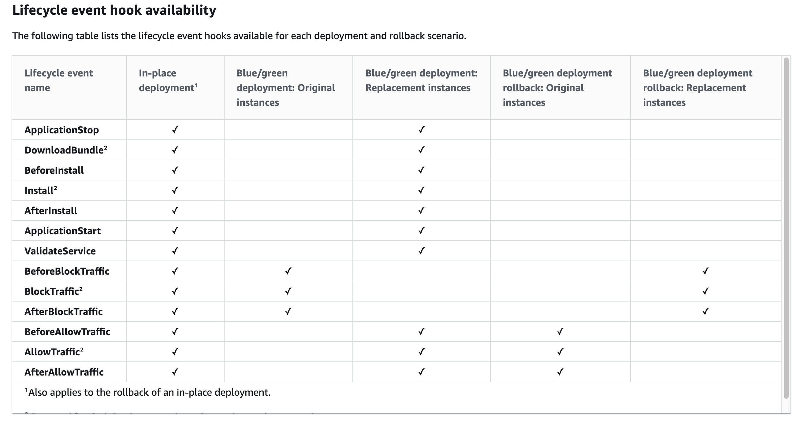
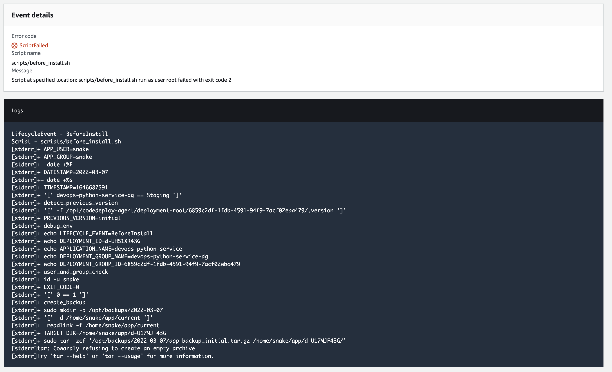

# CodeDeploy Demo

This is a example on using CodePipeline with CodeDeploy for EC2 deployments.

## About

We will manually create IAM Roles, CodePipeline, CodeDeploy and setup our EC2 instance for deployment of our Python FastAPI application.

The source code for this example will reside on CodeCommit which is an assumption that already exists.

## IAM

The following can be referenced to create the CodeDeploy Service IAM Role and the EC2 IAM Instance Profile:

- [IAM Service Role](https://docs.aws.amazon.com/codedeploy/latest/userguide/getting-started-create-service-role.html)
- [IAM Instance Profile](https://docs.aws.amazon.com/codedeploy/latest/userguide/getting-started-create-iam-instance-profile.html)

### Service Role

In short, to create the service role name `CodeDeployServiceRole`:

```bash
aws iam create-role --role-name CodeDeployServiceRole --assume-role-policy-document file://aws/codedeploy_trust.json
```

For EC2/On-Premise compute platform, we will need to attach the AWSCodeDeploy service role:

```bash
aws iam attach-role-policy --role-name CodeDeployServiceRole --policy-arn arn:aws:iam::aws:policy/service-role/AWSCodeDeployRole
```

### Instance Profile

To create the EC2 Instance Profile, create the Role `CodeDeployDemo-EC2-Instance-Profile`:

```bash
aws iam create-role --role-name CodeDeployDemo-EC2-Instance-Profile --assume-role-policy-document file://aws/codedeploy_ec2_trust.json
```

Add the IAM Policy to the Role:

```bash
aws iam put-role-policy --role-name CodeDeployDemo-EC2-Instance-Profile --policy-name CodeDeployDemo-EC2-Permissions --policy-document file://aws/codedeploy_ec2_permissions.json
```

Attach the SSM Managed policy to the Role if you are using SSM to install the CodeDeploy Agent:

```bash
aws iam attach-role-policy --policy-arn arn:aws:iam::aws:policy/AmazonSSMManagedInstanceCore --role-name CodeDeployDemo-EC2-Instance-Profile
```

Create the instance profile, then add the role to the instance profile:

```bash
aws iam create-instance-profile --instance-profile-name CodeDeployDemo-EC2-Instance-Profile
aws iam add-role-to-instance-profile --instance-profile-name CodeDeployDemo-EC2-Instance-Profile --role-name CodeDeployDemo-EC2-Instance-Profile
```

## EC2 Instance

Create a EC2 instance, and on the instance creation page, ensure to select the `CodeDeployDemo-EC2-Instance-Profile` IAM Role for the EC2 instance.

For this scenario we will be installing the codedeploy agent manually, but you can use AWS Systems Manager to install it.

### CodeDeploy Agent Installation

Install Dependencies on the EC2 instance:

```bash
sudo apt update
sudo apt install wget ruby-full -y
```

Installation of the CodeDeploy Agent:

```bash
export cd_region=eu-west-1
export cd_bucket_name="aws-codedeploy-${cd_region}"

wget "https://${cd_bucket_name}.s3.${cd_region}.amazonaws.com/latest/install"
chmod +x ./install
sudo ./install auto > /tmp/logfile
```

Ensure the codedeploy agent is running:

```bash
sudo service codedeploy-agent status
```

Note: Whenever changes are made to the IAM Role or Permissions, the codedeploy agent needs to be restarted with:

```bash
sudo service codedeploy-agent restart
```

We will be referencing the EC2 instances Tags from CodeDeploy, so head over to EC2 and focus on the Tags, which we will use these values later:


## Create CodeDeploy Application

From CodeDeploy, select Applications:


Name the application and the compute platform, which in this case will be EC2/On-Prem:


Next you should be directed to the "Deployment groups" page:


Where we will create a deployment group, for this use-case we will be using a "In-place" deployment typem which updates the instance with the latest revision of the deployment:


Then on "Environment configuration" select "Amazon EC2 instances", then select the Key/Value for the Tags:


We have bootstrapped the AWS CodeDeploy Agent with a AMI, but it is recommended to use AWS Systems Manager, for this use-case, we will not be installing the AWS CodeDeploy Agent since it's already installed:


For "Deployment settings" we will use OneAtATime so that only one instance gets changed at a time:


Because this example uses a "In-place" deployment, we won't be using a Load Balancer:


Under the advanced settings, select "Roll back when a deployment fails" under "Rollbacks" and set the "Deployment group tags" to "ManagedBy" to "codedeploy":


Then select "Create deployment group", then you will be directed to the "Applications" screen:


From here we can create a manual deployment, but we will skip this for now. 

## CodePipeline

Create a CodePipeline:


Add the "source" stage to codecommit, select our repository and the branch that we are targeting:


For this scenario, skip the build stage, and select AWS CodeDeploy as the "Deploy" stage, set the "Application name" to the application we defined in CodeBuild and select the "Deployment group" as the deployment group we defined in our CodeDeploy application:


On the "Review" screen, note that the "OutputArtifactFormat" has "CODE_ZIP":


The reason for that is that CodePipeline zip's the revision and uploads it on S3, during the CodeDeploy [lifecycle event hooks](https://docs.aws.amazon.com/codedeploy/latest/userguide/reference-appspec-file-structure-hooks.html#reference-appspec-file-structure-hooks-availability), the lifecycle event `DownloadBundle` which happens right after `ApplicationStop` downloads the zip and installs it to the `destination` specified in the `files` section of the `appspec.yml`: 



Then select "Create pipeline", note that when you create the pipeline it will trigger its first run, and in my case it will fail as the branch that I selected does not exist yet.

Make a commit to that branch, and if the pipeline is successful, it should look like the following:


We can view the deployment:


And when we view the events:


If any of the events failed, it will look like this:


And you can view the event:


When we select the `ScriptFailed` hyperlink we can view the stderr of the script:



## CodeDeploy Environment Variables

The following environment variables are accessible using the codedeploy agent:

- `LIFECYCLE_EVENT`: This variable contains the name of the lifecycle event associated with the script.
- `DEPLOYMENT_ID`:  This variables contains the deployment ID of the current deployment.
- `APPLICATION_NAME`:  This variable contains the name of the application being deployed. This is the name the user sets in the console or AWS CLI.
- `DEPLOYMENT_GROUP_NAME`:  This variable contains the name of the deployment group. A deployment group is a set of instances associated with an application that you target for a deployment.
- `DEPLOYMENT_GROUP_ID`: This variable contains the ID of the deployment group in AWS CodeDeploy that corresponds to the current deployment

When dumping them to a file, the will look more or less like the following:

```bash
LIFECYCLE_EVENT=BeforeInstall
DEPLOYMENT_ID=d-MS07UR13G
APPLICATION_NAME=devops-python-service
DEPLOYMENT_GROUP_NAME=devops-python-service-dg
DEPLOYMENT_GROUP_ID=6859c2df-1fdb-4591-94f9-7acf02eba479
```

- [Source](https://aws.amazon.com/blogs/devops/using-codedeploy-environment-variables/)

## CodeDeploy Runtime

When a deployment occurs, the home for the deployment root will be at this location by default:

- `/opt/codedeploy-agent/deployment-root/`

Under the `deployment-root` directory you will find the `DEPLOYMENT_GROUP_ID` and under that you will find the `DEPLOYMENT_ID` directories:

```bash
/opt/codedeploy-agent/deployment-root/6859c2df-1fdb-4591-94f9-7acf02eba479/
├── d-4AG56713G
│   ├── bundle.tar
│   ├── deployment-archive
│   │   ├── Dockerfile
│   │   ├── Makefile
│   │   ├── README.md
│   │   ├── appspec.yml
│   │   ├── configs
│   │   │   ├── hypercorn.toml
│   │   │   ├── python-app.service
│   │   │   └── sample.env
│   │   ├── dependencies
│   │   │   └── requirements.pip
│   │   ├── docker-compose.yml
│   │   ├── scripts
│   │   │   ├── after_install.sh
│   │   │   ├── before_install.sh
│   │   │   ├── start_server.sh
│   │   │   ├── stop_server.sh
│   │   │   └── validate_service.sh
│   │   ├── src
│   │   │   ├── config.py
│   │   │   ├── main.py
│   │   │   ├── models.py
│   │   │   └── tests
│   │   │       ├── __init__.py
│   │   │       └── test_main.py
│   │   └── trigger
    └── logs
        └── scripts.log

```

As you can see we have multiple `DEPLOYMENT_ID`'s, as each deployment has it's unique DEPLOYMENT_ID:

```bash
$ ls /opt/codedeploy-agent/deployment-root/6859c2df-1fdb-4591-94f9-7acf02eba479/
d-4AG56713G  d-MS07UR13G  d-MUISVJ03G  d-OTDLJNZ2G  d-QZD1YU03G
```

The source code for the deployment has been extracted under:

```bash
$ ls /opt/codedeploy-agent/deployment-root/${DEPLOYMENT_GROUP_ID}/${DEPLOYMENT_ID}/deployment-archive/
Dockerfile  Makefile  README.md  appspec.yml  configs  dependencies  docker-compose.yml  scripts  src  trigger
```

The logs can be found under:

```bash
$ ls /opt/codedeploy-agent/deployment-root/${DEPLOYMENT_GROUP_ID}/${DEPLOYMENT_ID}/logs/
scripts.log
```

The install step (which happens after before_install), extracts the deployment archive to: `/home/snake/_target` which is set as the destination on the `appspec.yml` and since the source is `/` it means everything will be included from the source repo. The archive is also extracted to the following directory: `/opt/codedeploy-agent/deployment-root/6859c2df-1fdb-4591-94f9-7acf02eba479/d-JYMPSK23G/deployment-archive`

## Example Deploy

### Deployment Target

When we commit a test file, foobarfile:

```bash
$ echo 1 > foobarfile
$ git add foobarfile
$ git commit -m "add foobarfile" && git push origin master
```

In our appspec.yml, we defined the target of of our deployment in the /home/snake/_target directory:

```yaml
version: 0.0
os: linux
files:
  - source: /
    destination: /home/snake/_target
```

On our deployment target (EC2), if we search for the foobarfile, we will find it in:

- `/home/snake/_target/foobarfile`
- `/opt/codedeploy-agent/deployment-root/${DEPLOYMENT_GROUP_ID}/${DEPLOYMENT_ID}/deployment-archive/foobarfile`

```bash
$ find / -name foobarfile -type f
/opt/codedeploy-agent/deployment-root/6859c2df-1fdb-4591-94f9-7acf02eba479/d-GBGEACQ8G/deployment-archive/foobarfile
/home/snake/_target/foobarfile
```

If we list the DEPLOYMENT_GROUP_ID we will find the deployment revisions (not limited to 2 revisions):

```bash
$ ls -latr /opt/codedeploy-agent/deployment-root/6859c2df-1fdb-4591-94f9-7acf02eba479/
total 25
drwxr-xr-x 6 root root 4096 Mar  7 16:16 ..
drwxr-xr-x 4 root root 4096 Mar 16 09:05 d-810J8UP8G
drwxr-xr-x 4 root root 4096 Mar 16 09:40 .
drwxr-xr-x 4 root root 4096 Mar 16 09:40 d-GBGEACQ8G
```

In this case when we look at the previous revision, we will note that the foobarfile is not present:

```bash
$ ls /opt/codedeploy-agent/deployment-root/6859c2df-1fdb-4591-94f9-7acf02eba479/d-810J8UP8G/deployment-archive/ | grep foobarfile | wc -l
0
```

### Deployment Logs

There’s two locations for logs, we have the combined view, and per deployment log:

- Combined: `/opt/codedeploy-agent/deployment-root/deployment-logs/codedeploy-agent-deployments.log`
- Per-Deployment: `/opt/codedeploy-agent/deployment-root/6859c2df-1fdb-4591-94f9-7acf02eba479/d-GBGEACQ8G/logs/scripts.log`

The combined view:

```bash
$ cat /opt/codedeploy-agent/deployment-root/deployment-logs/codedeploy-agent-deployments.log | tail -n3
[2022-03-16 09:40:52.800] [d-GBGEACQ8G][stdout]{"status":"ok"}[2022-03-16T09:03] application passing health checks
[2022-03-16 09:40:52.800] [d-GBGEACQ8G][stderr]+ echo d-GBGEACQ8G
[2022-03-16 09:40:52.800] [d-GBGEACQ8G][stderr]+ echo d-GBGEACQ8G
```

The per-deployment view:

```bash
$ cat /opt/codedeploy-agent/deployment-root/6859c2df-1fdb-4591-94f9-7acf02eba479/d-GBGEACQ8G/logs/scripts.log | tail -n3
2022-03-16 09:40:52 [stdout]{"status":"ok"}[2022-03-16T09:03] application passing health checks
2022-03-16 09:40:52 [stderr]+ echo d-GBGEACQ8G
2022-03-16 09:40:52 [stderr]+ echo d-GBGEACQ8G
```

## Resources

- https://docs.aws.amazon.com/codedeploy/latest/userguide/reference-appspec-file-structure-hooks.html#appspec-hooks-server
- https://docs.aws.amazon.com/codedeploy/latest/userguide/reference-appspec-file.html
- https://docs.aws.amazon.com/codedeploy/latest/userguide/codedeploy-agent-operations-install-ubuntu.html
- https://docs.aws.amazon.com/codedeploy/latest/userguide/reference-appspec-file-structure-hooks.html
- https://docs.aws.amazon.com/codedeploy/latest/userguide/reference-appspec-file-structure-files.html